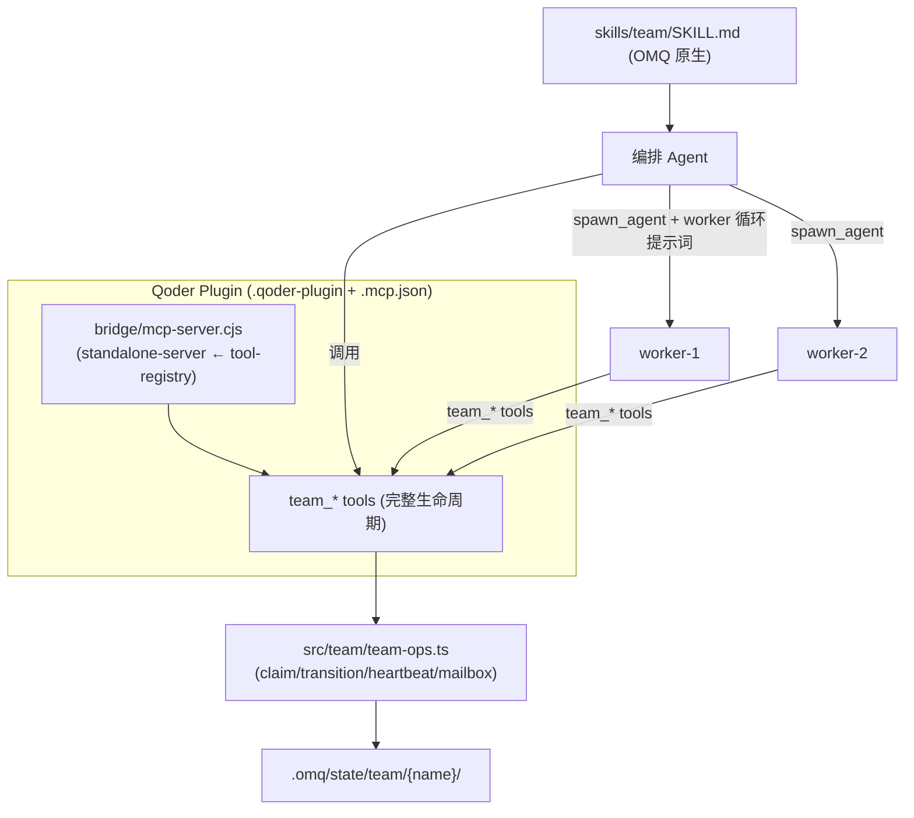

# OMQ Agent Teams 能力补全实施规划

> 状态: Draft v1 · 负责人: (待定) · 适用仓库: `oh-my-qoder`
>
> 目标读者: 实施工程师。本文给出"为什么 / 改哪里 / 改成什么 / 怎么验收"的完整路线。

---

## 0. 背景与前提

Qoder CLI **原生不支持 agent teams**（不同于 Claude Code 的 native teams / Task 工具）。因此 OMQ 的目标是**自建一整层完整的 agent teams 能力**。

经代码审查确认的现状：

- **后端引擎已基本完整**：`src/team/team-ops.ts` + `src/team/api-interop.ts` + `src/team/state/tasks.ts` 已实现共享任务板、原子认领（claim token + 乐观版本号）、状态机迁移、邮箱/广播、心跳、事件日志、审批门禁、优雅关闭握手、监控快照、文件锁与原子写。
- **三层是断的**：
  1. **暴露层**：完整生命周期（create/claim/transition/release/heartbeat）在 MCP 与 CLI 两个出口都触达不到。
  2. **Worker 运行时**：file-based 模式没有"worker 自治循环"，没人写心跳，`team_status` 永远显示 worker dead。
  3. **编排入口**：`skills/team/SKILL.md` 仍用 Claude 原生 `Task(team_name=...)` / `TeamCreate`。
- **三套并存且互不自洽**：继承的 tmux 运行时、新 file-based MCP 层、技能里的 Claude 原生说法。
- **构建缺步骤**：`bridge/team-mcp.cjs`、`bridge/team-bridge.cjs` 不产出。

### 关键证据（文件:行）

| 事实 | 位置 |
|------|------|
| 后端有 `teamClaimTask` / `teamTransitionTaskStatus` / `teamReleaseTaskClaim` | `src/team/team-ops.ts:407,455,481` |
| 后端有心跳/身份/邮箱标记/关闭握手 | `src/team/team-ops.ts:258-306,631-661,793-819` |
| 规范操作集含 create/claim/transition | `src/team/api-interop.ts:90-122,702,798,812` |
| MCP 工具只有 10 个瘦身工具，`team_task_update` 是裸覆写 | `src/tools/team-tools.ts:221-251,363-374` |
| 插件 MCP 工具表 **未包含** teamTools（注释还是旧 `omq_run_team_*`） | `src/mcp/tool-registry.ts:12-13,49-61` |
| 插件 MCP server 从 tool-registry 取工具 | `src/mcp/standalone-server.ts:20,55` |
| SDK 路径已挂 teamTools（但非插件路径） | `src/mcp/omq-tools-server.ts:21,110` |
| CLI `omq team api` gate 掉 create/claim/transition | `src/cli/team.ts:22-33` |
| 技能仍用 Claude 原生 Task/TeamCreate | `skills/team/SKILL.md:72,692,786` |
| build 不调用 team-server/bridge-entry | `package.json:35-36` |

---

## 1. 目标与非目标

### 目标 (Goals)
1. 选定**单一主路径**：**file-based 状态 + MCP 工具暴露 + Qoder `spawn_agent` worker 循环**。
2. 把已实现的并发安全生命周期**完整暴露**到插件 MCP，使编排 agent 可驱动任务板。
3. 提供**worker 自治循环**（bootstrap 提示词），让 spawn 出的 agent 能注册→认领→干活→迁移→心跳→关闭。
4. 重写 `$team` 技能为 OMQ 原生流程，删除所有 Claude 原生 `Task()` 依赖。
5. 修复构建与打包，确保 clean build + 全新安装即可用。
6. 提供轻量监控闭环（死 worker 检测、超时任务回收）。

### 非目标 (Non-Goals)
- 不强求保留 tmux 运行时；本规划将其降级为"二选一收敛"项（见 Phase 5），默认**废弃**以收敛维护面。
- 不在本规划内做跨仓库（`.omq-workspace`）teams。
- 不改动后端引擎的存储格式（向后兼容现有 `.omq/state/team/...`）。

---

## 2. 架构决策 (ADR)

**决策**: 采用 **file-based + MCP + spawn_agent** 作为 OMQ teams 的唯一一等公民路径。

**理由**:
- 不依赖 tmux/GUI，最贴合 Qoder CLI 的无界面、可嵌入形态。
- 后端引擎天然是 file-based，复用度最高。
- `spawn_agent` 是 Qoder 既有的子代理原语；worker = "被注入 worker 循环提示词的 spawn_agent 子代理"。

**形态**:

```
编排 Agent (leader)
  ├─ team_create                → 建团（写 config/manifest）
  ├─ team_task_create × N       → 派活到共享任务板
  ├─ spawn_agent × M            → 每个注入「worker 循环提示词 + worker_name」
  │     each worker loop:
  │        team_register_worker → 写身份
  │        loop:
  │          team_update_heartbeat
  │          team_next_ready_task / team_claim_task   (原子认领)
  │          <do work>
  │          team_transition_task (in_progress→completed/failed, 带 claimToken)
  │          team_list_mailbox / team_send_message
  │          检查 shutdown 请求 → ack 退出
  ├─ team_status (轮询)          → 任务计数 + 心跳 + 未读消息
  └─ team_request_shutdown      → 收尾
```

存储沿用 `TeamPaths`（`src/team/state-paths.ts`），与现有 `team-ops` 完全一致。

---

## 3. 目标架构图



---

## 4. 分阶段实施计划

> 总原则：**先打通一条最小端到端链路（Phase 1+2+3），再补监控与收敛（Phase 4+5）**。每个 Phase 可独立提交、独立验收。

---

### Phase 1 — 暴露完整生命周期到 MCP（解锁引擎）

**目标**：让编排 agent 与 worker 能通过 MCP 工具使用后端已实现的原子协议。

**改动文件**：

1. `src/tools/team-tools.ts` — 新增以下工具（直接转调 `team-ops.ts` 已有函数）：

| 新工具 | 转调后端 | 说明 |
|--------|---------|------|
| `team_register_worker` | `teamWriteWorkerIdentity` | worker 启动时登记身份，并把 worker 写入 config.workers |
| `team_claim_task` | `teamClaimTask(team, taskId, worker, expectedVersion)` | 返回 claim_token；失败返回 blocked/conflict |
| `team_next_ready_task` | `teamListTasks` + 就绪筛选 + `teamClaimTask` | 便捷工具：自动挑一个无阻塞 pending 任务并认领 |
| `team_transition_task` | `teamTransitionTaskStatus(team, taskId, from, to, claimToken, terminalData)` | 携带 claimToken 的状态迁移 |
| `team_release_claim` | `teamReleaseTaskClaim` | 放弃认领 |
| `team_update_heartbeat` | `teamUpdateWorkerHeartbeat` | worker 周期性心跳 |
| `team_mark_message_delivered` | `teamMarkMessageDelivered` | 读信后标记 |
| `team_request_shutdown` | `teamWriteShutdownRequest` | leader 请求 worker 退出 |
| `team_read_shutdown_ack` | `teamReadShutdownAck` | leader 确认 worker 已退出 |

- **同时**：废弃或重写 `team_task_update`，使其不再做裸覆写——要么标注 deprecated 并内部走 transition，要么仅允许非状态字段更新。状态变更一律走 `team_transition_task`。

工具骨架（参照现有 `team-tools.ts` 风格）：

```ts
export const teamClaimTaskTool: ToolDefinition<{
  team_name: z.ZodString;
  task_id: z.ZodString;
  worker_name: z.ZodString;
  expected_version: z.ZodOptional<z.ZodNumber>;
  workingDirectory: z.ZodOptional<z.ZodString>;
}> = {
  name: 'team_claim_task',
  description: 'Atomically claim a task. Returns a claim_token required for later status transitions.',
  schema: { /* ... */ },
  handler: async (args) => {
    const cwd = resolveDir(args.workingDirectory);
    const res = await teamClaimTask(args.team_name, args.task_id, args.worker_name, args.expected_version ?? null, cwd);
    if (!res.ok) return errorResponse(JSON.stringify(res));
    return textResponse(JSON.stringify(res, null, 2));
  },
};
```

2. `src/mcp/tool-registry.ts` — **核心修复**：
   - 在 `allTools`（`:49-61`）加入 `...(teamTools as unknown as ToolDef[])`。
   - 更新顶部过期注释（`:12-13`）：删除 `omq_run_team_*` 旧说法，改述 file-based team 工具。
   - `import { teamTools } from '../tools/team-tools.js';`

3. `src/mcp/omq-tools-server.ts` — 已含 `teamTools`（`:110`），确认导出的工具集与新工具一致（同一个 `teamTools` 数组即可，自动同步）。

**验收标准**：
- [ ] `npm run build` 后，`buildListToolsResponse()` 返回的工具表包含全部 `team_*`（含新工具）。
- [ ] 新增/更新单测 `src/__tests__/`：对每个新工具做 happy-path + 错误路径（认领冲突、错误 claimToken、找不到任务）。
- [ ] 并发用例：两个并发 `team_claim_task` 同一任务，仅一个成功。
- [ ] `lsp_diagnostics_directory` 无类型错误。

**验证命令**：
```bash
npm run build && npm run test:run -- team
```

---

### Phase 2 — Worker 自治循环（spawn_agent worker）

**目标**：提供可注入到 `spawn_agent` 子代理的"worker 循环提示词"，使 worker 能自治工作并写心跳。

**改动文件**：

1. 新增 `src/team/worker-loop-prompt.ts`（或 `templates/team/worker-loop.md`）— 导出一个函数：
   ```ts
   export function buildWorkerLoopPrompt(opts: {
     teamName: string;
     workerName: string;
     workingDirectory: string;
     rolePrompt?: string;     // 可选：注入 executor/test-engineer 等角色提示词
   }): string
   ```
   提示词内容（关键指令，给 worker 看）：
   - 你是 `{workerName}`，属于团队 `{teamName}`，工作目录 `{workingDirectory}`。
   - 启动即调用 `team_register_worker`，随后进入循环。
   - 每轮：先 `team_update_heartbeat`；用 `team_next_ready_task` 认领任务（拿到 `claim_token`）。
   - 无可认领任务时，检查 `team_read_shutdown` 请求；若有则收尾后停止，否则报告"待命"并结束本轮（由 leader 决定是否再 spawn）。
   - 完成任务后用 `team_transition_task`（带 `claim_token`，`in_progress→completed`，附 result）。
   - 失败则 `in_progress→failed` 并写 error；必要时 `team_release_claim`。
   - 通过 `team_list_mailbox` / `team_send_message` 与 leader/同伴协作。
   - 严禁使用 Claude 原生 `Task()` / `TeamCreate`。

2. `src/tools/team-tools.ts` — `team_create` 描述更新（`:62,103`）：把 "use the Agent tool to spawn workers" 改为明确指向 `spawn_agent` + 注入 `buildWorkerLoopPrompt` 产物。

3. （可选）新增 `team_spawn_worker` 工具或在技能层用 `spawn_agent` 直接拉起 —— 取决于 Qoder `spawn_agent` 是否可被 MCP 工具内部调用。**默认放在技能层**（见 Phase 3），因为 `spawn_agent` 是宿主 CLI 能力，不应由 MCP server 进程调用。

**设计说明（重要）**：
- Qoder `spawn_agent` 产出**单轮子代理**，不是常驻进程。因此"循环"由两层保证：
  - **微循环**：单个 worker 在自己这轮里尽量多认领并完成任务（while 有就绪任务）。
  - **宏循环**：leader 在 `team_status` 显示仍有 pending 且无存活 worker 时，再次 `spawn_agent` 补员。
- 心跳的意义从"进程存活"调整为"最近一次 worker 轮次时间"，`team_status` 的 `alive` 判定阈值需相应放宽（见 Phase 4）。

**验收标准**：
- [ ] 提示词函数有单测：给定参数，产出包含 worker_name/team_name/关键指令、且**不含** `Task(`。
- [ ] 端到端冒烟（手动或脚本）：leader 建团→派 2 个任务→spawn 2 worker→两任务均到 `completed`，`team_status` 显示心跳时间。

---

### Phase 3 — 重写 `$team` 编排技能为 OMQ 原生

**目标**：技能文档驱动的流程与新 MCP 工具 + spawn_agent 完全一致，移除 Claude 原生 API。

**改动文件**：

1. `skills/team/SKILL.md` — 全量改写编排流程：
   - 删除所有 `Task(team_name=...)`、`TeamCreate`、`SendMessage`（Claude 原生）引用（`:72,692,786` 等）。
   - 新流程：`team_create` → `team_task_create`×N → `spawn_agent`（注入 worker 循环提示词）×M → 轮询 `team_status` → 失败任务重派/补员 → `team_request_shutdown` → `team_delete`。
   - 明确并发上限（与 AGENTS.md 的"最多 6 并发子代理"对齐）。
2. `skills/omq-teams/SKILL.md` — 同步校对（若与 team 技能重叠，明确二者关系或合并）。
3. `AGENTS.md` — `<team_pipeline>` / `<team_compositions>` 段落校对，确保描述与实现一致；删除/订正 `QODER_LITE_MODEL`、`QODER_PERFORMANCE_MODEL` 等未实现项（或在 Phase 6 实现）。
4. 全仓扫描：`grep -rn "Task(" skills/` 应仅剩非 teams 语义的合法用法；teams 相关一律清零。

**验收标准**：
- [ ] `grep -rn "Task(" skills/team/SKILL.md skills/omq-teams/SKILL.md` 无输出。
- [ ] 按技能文档手动走一遍，能在无 tmux 环境完成一个 2-worker 团队任务。

---

### Phase 4 — 监控闭环（死 worker / 超时任务回收）

**目标**：基于已有 heartbeat + claim token + monitor snapshot，做最小可用的健康治理。

**改动文件**：

1. `src/tools/team-tools.ts` 或新增 `src/team/team-reaper.ts`：
   - `team_reap`（或在 `team_status` 内联）：扫描 `in_progress` 且 claim 超时（claim 时间/心跳超过阈值）的任务，自动 `team_release_claim` 回到 `pending`，并 `teamAppendEvent` 记录。
   - `team_status` 的 `alive` 判定改为基于"最近心跳 < 阈值（如 5min）"。
2. 阈值与策略集中到常量（复用 `src/team/contracts.ts` 或 governance）。

**验收标准**：
- [ ] 单测：构造一个 stale claim，`team_reap` 后任务回到 pending 且事件被记录。
- [ ] `team_status` 对超时心跳 worker 标记 `alive:false`。

---

### Phase 5 — 收敛：tmux 运行时二选一

**目标**：消除三套并存，降低维护面。**默认废弃 tmux 路径**。

**两个选项（择一执行）**：

- **A（推荐）废弃 tmux 路径**：
  - 移除/归档 `src/cli/team.ts` 的 `start/wait/resume/shutdown` tmux 子命令与 `runtime-v2.ts`/`tmux-session.ts` 调用入口（保留 `team-ops`/`api-interop` 引擎与 `team api` 只读操作）。
  - 删除对 `bridge/team-mcp.cjs`、`bridge/team-bridge.cjs`、`gyoshu_bridge.py` 的依赖与文档引用。
  - 更新 `docs/REFERENCE.md`、`docs/MIGRATION.md`、`docs/qoder-cli/subagents.md`。
- **B 保留并修复 tmux 路径**：
  - 在 `src/cli/team.ts` 的 `SUPPORTED_API_OPERATIONS`（`:22-33`）放开 `create-task` / `claim-task` / `transition-task-status` / `release-task-claim`（`api-interop.ts` 已实现），修复 `worker-bootstrap.ts` 断链。
  - 把 `build:team-server` / `build:bridge-entry` 加回构建（见 Phase 6）。

**验收标准**：
- [ ] 选 A：`grep -rn "team start\|tmux" docs/ skills/` 无误导性残留；`omq team --help` 不再宣传已废弃子命令。
- [ ] 选 B：`omq team api claim-task` 端到端可用，worker-bootstrap 测试通过。

---

### Phase 6 — 构建、打包与命名清理（横切）

**改动文件**：

1. `package.json`：
   - 若 Phase 5 选 A：保持精简 build 即可，确认 `team-tools` 经 `build-mcp-server.mjs` 进入 `bridge/mcp-server.cjs`。
   - 若选 B：恢复 `build:team-server`、`build:bridge-entry`、`build:runtime-cli`、`build:cli` 到 `"build"`。
2. `.qoder-plugin/plugin.json`：补 `"mcpServers": "./.mcp.json"`（与 OMC 对齐），并修正 `marketplace.json` 名称/版本（当前仍是 `omc`/`4.14.7`）。
3. 命名清理（低风险但建议）：`resolveClaudeWorkerModel`→`resolveQwenWorkerModel`、`shouldUseClaudeBareMode` 等；`runtime-v2.ts` 注释 "Claude agents on Bedrock" 订正。
4. `AGENTS.md` 的 `QODER_LITE_MODEL` / `QODER_PERFORMANCE_MODEL`：**实现**（在 `src/config/models.ts` 与 `src/team/model-contract.ts` 加入对应 tier env 解析）**或从文档移除**。二选一，避免文档债。

**验收标准**：
- [ ] 干净 checkout 上 `npm ci && npm run build` 成功，产物含可用的 `team_*` 工具。
- [ ] `npm run test:run` 全绿，`eslint src` 无新增告警。

---

## 5. 端到端验收（Definition of Done）

整体完成的判定（无 tmux 环境下）：

1. 全新安装（插件方式）后，编排 agent 在会话中可调用 `team_create` / `team_task_create` / `team_status` 等全部 `team_*` 工具。
2. 按 `$team` 技能流程，能创建团队、用 `spawn_agent` 拉起 ≥2 worker、worker 自治认领并完成任务、`team_status` 反映真实进度与心跳。
3. 制造并发认领冲突时，任务板保持一致（无重复完成、claim token 生效）。
4. 制造 worker 中途失联时，`team_reap` 能回收超时任务并继续推进。
5. 仓库内不存在 teams 语义的 Claude 原生 `Task()` / `TeamCreate` 引用。
6. `npm ci && npm run build && npm run test:run` 全绿。

---

## 6. 风险与回滚

| 风险 | 缓解 |
|------|------|
| `spawn_agent` 不能在 MCP server 进程内调用 | 把 worker 拉起放在**技能/编排层**（leader agent 调用宿主 `spawn_agent`），MCP 只管状态。已在 ADR 采纳。 |
| 单轮子代理无法长循环 | 采用"微循环 + leader 宏循环补员"双层模型（Phase 2）。 |
| 改 `team_task_update` 影响既有调用方 | 保留工具名，内部转 transition；或标 deprecated 一个版本周期。 |
| file 锁在高并发下退化 | 已有 stale 检测 + 退避重试；压测纳入 Phase 1 用例。 |
| 与现有 `.omq/state/team` 数据不兼容 | 不改存储格式；`team-ops` 已含 legacy 读取兼容（`readLegacyMailboxJsonl`）。 |

**回滚**：每个 Phase 独立提交；Phase 1（tool-registry 注册）是唯一对插件可见行为的关键变更，回退即移除 `teamTools` 注册一行。

---

## 7. 里程碑与建议顺序

| 里程碑 | 包含 | 产出 |
|--------|------|------|
| M1 「引擎接通」 | Phase 1 | 插件 MCP 暴露完整 team 生命周期工具 |
| M2 「能跑起来」 | Phase 2 + 3 | spawn_agent worker 循环 + OMQ 原生技能，端到端可用 |
| M3 「跑得稳」 | Phase 4 | 监控/回收闭环 |
| M4 「收敛干净」 | Phase 5 + 6 | 单一路径 + 构建打包 + 命名/文档清理 |

**建议起点**：M1（Phase 1）。它改动最小、解锁整条链路、对现有行为风险最低——只需在 `tool-registry.ts` 注册 `teamTools` 并补齐 `team-tools.ts` 的生命周期工具。

---

## 8. 变更文件速查

| 文件 | Phase | 动作 |
|------|-------|------|
| `src/tools/team-tools.ts` | 1,2,4 | 新增生命周期/心跳/关闭/回收工具；改 `team_create`、`team_task_update` 描述 |
| `src/mcp/tool-registry.ts` | 1 | 注册 `teamTools`；订正注释 |
| `src/mcp/omq-tools-server.ts` | 1 | 校对工具集一致 |
| `src/team/worker-loop-prompt.ts`(新) | 2 | worker 循环提示词构造 |
| `skills/team/SKILL.md` | 3 | 重写为 OMQ 原生流程 |
| `skills/omq-teams/SKILL.md` | 3 | 同步/合并 |
| `AGENTS.md` | 3,6 | pipeline 校对；tier env 实现或删除 |
| `src/team/team-reaper.ts`(新) 或 team-tools | 4 | 超时回收 |
| `src/cli/team.ts` | 5B | 放开 api 操作（若保留 tmux） |
| `package.json` | 6 | build 步骤 |
| `.qoder-plugin/plugin.json` / `marketplace.json` | 6 | mcpServers / 名称版本 |
| `src/team/model-contract.ts`, `src/config/models.ts` | 6 | 命名清理 / tier env |
| `docs/REFERENCE.md`, `docs/MIGRATION.md` | 5,6 | 文档同步 |
| `src/__tests__/*team*` | 1-4 | 单测/并发/端到端 |
